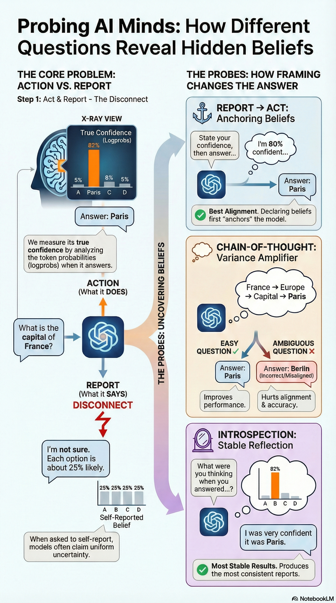

# Epistemic Channel Divergence

This research repository holds a chunk of the code and experimental results originating from my investigation into methods for reliable readings of LLM belief.  
research toolkit for measuring the divergence between what LLMs **believe** (behavioral/token-level) and what they **report** (declarative self-reports).

## The Core Discovery

**Self-reported probabilities are not introspective access.** They are outputs of a learned reporting policy that operates largely independently of the model's actual decision-making process.


## The Three-Layer Model

Everything we observe reduces to a three-layer system with two attractors:

### Layer 1: Action System

The action system operates on token-level distributions and is:

- **Sensitive** to option order, small semantic perturbations, and reasoning paths
- **Reveals** true confidence when logprobs are available
- **Unstable** under semantic-preserving interventions (3-6x more than reports)

### Layer 2: Reporting System

The reporting system is a separate, learned policy that is:

- **Dominated by attractors**: uniform hedge (primary), boundary hedge (secondary)
- **Largely insensitive** to incentives, calibration threats, and small perturbations
- **Stabilized** by training pressure toward cautious probability expressions

### Layer 3: Structural Symmetries

Multiple-choice option order is a nuisance symmetry:

- Single-shot probing samples one arbitrary embedding of content into position
- Argmax flips in 52-64% of orderings due to position bias alone
- Ensembling over orderings marginalizes the symmetry and restores invariance

## Settled Facts

These findings are robust across providers, probe orderings, and perturbations:

1. **Uniform and boundary hedging are learned policy attractors** - not expressions of genuine uncertainty
2. **Belief-action divergence is largest when models are most confident** - the opposite of calibration
3. **Probe order and framing are causal interventions** - not presentation details
4. **CoT amplifies variance; introspection regularizes it** - reasoning doesn't improve alignment
5. **Incentives don't help** - this is a capability limitation, not strategic avoidance
6. **Structural symmetries must be marginalized** - single-shot measurement is unreliable
7. **Small ensembles (K≈4) recover most invariance** - a practical corrective method

## Quick Start

```bash
# Clone and setup
git clone https://github.com/meadowlark-bradsher/epistemic-channel-divergence.git
cd epistemic-channel-divergence
echo "OPENAI_API_KEY=sk-..." > .env
echo "GOOGLE_API_KEY=..." >> .env

# Core experiment: belief probe with anti-uniform constraint
python experiments/belief_probe_baseline.py --experiment2 --anti-uniform

# ESI experiment: structural sensitivity
python experiments/esi_runner.py --providers openai gemini --full

# Ensemble measurement: position debiasing
python experiments/esi_ensemble.py --providers openai gemini --bootstrap
```

## Navigation

- **[Findings](findings/index.md)** - Authoritative, stable claims organized by phenomenon
- **[Experiments](experiments/index.md)** - How to run each experiment and what it tests
- **[Lab Notes](labnotes/belief-probe-notes.md)** - Chronological research notes and provenance
